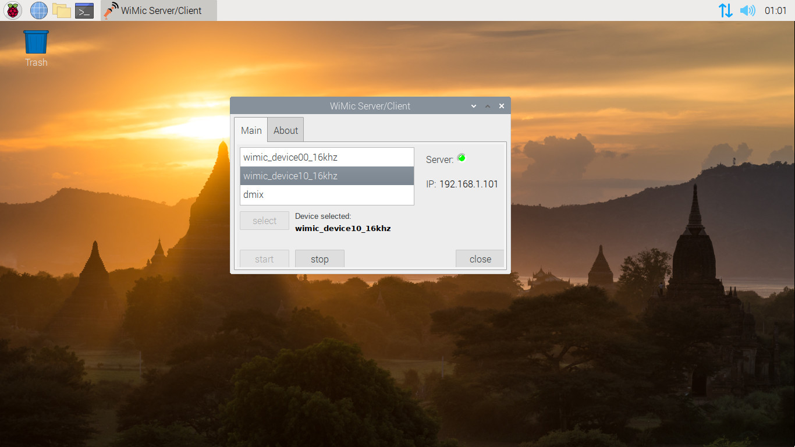

[](https://semaphoreci.com/hiro2233/wimic) [](https://travis-ci.org/hiro2233/wimic)  

# WiMic Server/Client

*Copyright (c) 2020 Hiroshi Takey F. <htakey@gmail.com>*

**WiMic Server/Client**  is a multiplatform remote wireless microphone (when connect with client side and third party driver and as speaker without the driver) server and client for use on PC Desktop, portable devices platforms or IoTs like Raspberry Pi, GNU OS Distributions (E.g. GNU/Linux), Arduinos, and more.

Official repo:
https://github.com/hiro2233/wimic

### Download Installer

| Host | Arch | Link |
| ---- | ---- | ---- |
| win  |  x86  | [](https://github.com/hiro2233/wimic/releases/download/v1.0.4-pre-win32/wimic_setup.exe)|
| raspbian | arm32 |  |

[See instruction at bottom for a brief about installation.](#Basic-install-steps)

<br/>

###### WiMic Server/Client on Ubuntu 16.04


<br/>

###### WiMic Server/Client on Raspberry Pi OS



<br/>

### Dependencies

- opus
- speexdsp
- portaudio
- libconfig
- boost-system
- log4cpp
- openssl
- Google Protobuf: libraries and compiler

### Building

###### (Debian/Ubuntu/Rasperry Pi OS)

```bash
git clone https://github.com/hiro2233/wimic.git
cd wimic
git submodule init
git submodule update --init --recursive
./install_deps.sh
```

exit from terminal, open again terminal then:

```bash
make
./bin/release/wimic
```

### WiMic Android Client App

You can connect to the server with WiMic Android App, this was designed and optimized to work with WiMic Server/Client.

<a href='https://play.google.com/store/apps/details?id=bo.htakey.wimic&pcampaignid=pcampaignidMKT-Other-global-all-co-prtnr-py-PartBadge-Mar2515-1'></a>

Official repo:

https://github.com/hiro2233/wimic_android

### Basic install steps

###### win32/win64

Download the [win host setup installer](#Download-Installer), then execute and follow the instruction on the window form.

###### (Rasperry Pi OS)

On terminal execute:

```bash
$ wget https://github.com/hiro2233/wimic/raw... 
$ chmod +x install_wimic.sh
$ source install_wimic.sh
```
and wait until this finish, then reboot raspberry and WiMic will autostart in service mode. By default WiMic server will use microphone on autostart mode, but if you want to use the speakers in autostart mode you can disable this doing:

```bash
$ echo 1 > /system/urus/slotdata/wimic_mic_disabled.txt
```

### Detailed install docs

Spanish:
https://hiro2233.github.io/wimic/docs/wimic/

English:
In progress... contributions are welcome!

### Video Tutorial

<a href='https://www.youtube.com/watch?v=EjYOHEgnx3Y'></a>
