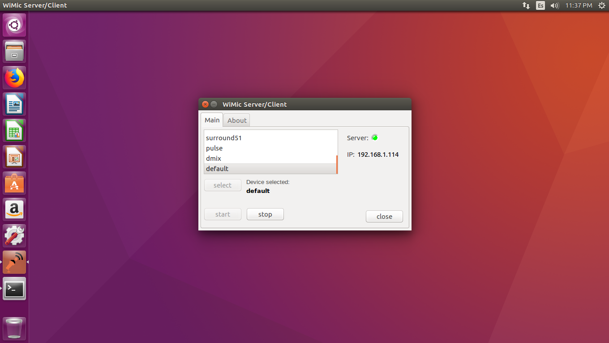

[](https://semaphoreci.com/hiro2233/wimic) [](https://travis-ci.org/hiro2233/wimic) 

# WiMic Server/Client

*Copyright (c) 2020 Hiroshi Takey F. <htakey@gmail.com>*

**WiMic Server/Client**  is a multiplatform remote wireless microphone (when connect with client side and third party driver and as speaker without the driver) server and client for use on PC Desktop, portable devices platforms or IoTs like Raspberry Pi, GNU OS Dstributions (E.g. Linux), Arduinos, and more.



###### Dependencies

- opus
- speexdsp
- portaudio
- libconfig
- boost-system
- log4cpp
- openssl
- Google Protobuf: libraries and compiler

### Building

###### (Debian/Ubuntu/Rasperry Pi OS)

```bash
git clone https://github.com/hiro2233/wimic.git
cd wimic
git submodule init
git submodule update --init --recursive
./install_deps.sh
```

exit from terminal, open again terminal then:

```bash
make
./bin/release/wimic
```
